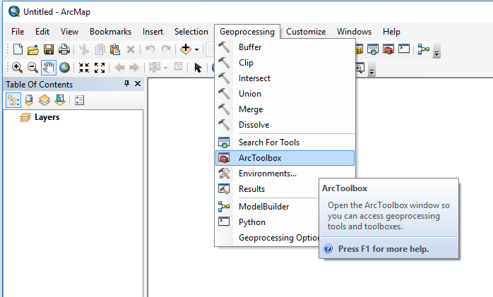
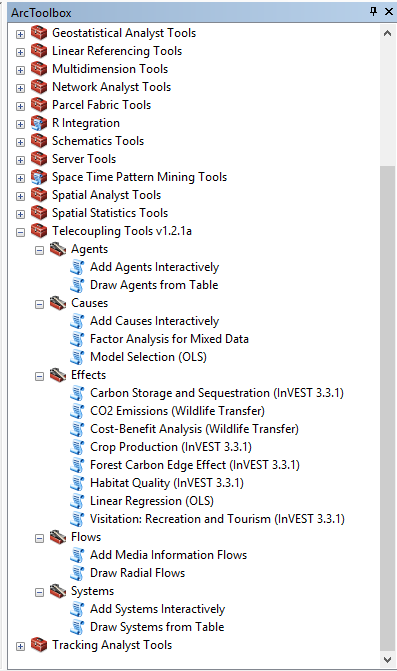

Telecoupling Toolbox v1.2.1a
===========

## Major Releases
------------------
* Version 1.2 (_alpha_)

This release eliminates the redundant presence of the “Draw Radial Flows and Nodes” tool (Flows toolset) while incorporating its old functionality into the existing “Draw Radial Flows” tool. 
The latter can now optionally draw and additional layer on top of the default flow lines, showing nodes at each flow destination, which can then be symbolized according to an attribute (quantity) of interest. 
The toolbox is still in _alpha_ development stage and is being tested for bugs and errors that need to be addressed before releasing a more stable _beta_ version.

* Version 1.1 (_alpha_)

This release includes an upgrade in the CO2 emission script tool accounting for number of wildlife units transferred and transportation capacity of the medium used. 
The tool now allows testing of future CO2 emission scenarios for wildlife transfer compared to current conditions.
The toolbox is still in _alpha_ development stage and is being tested for bugs and errors that need to be addressed before releasing a more stable _beta_ version.

* Version 1.0 (_alpha_)

This is the first version officially released for the Telecoupling Toolbox for ArcGIS. 
The toolbox is still in _alpha_ development stage and is being tested for bugs and errors that need to be addressed before releasing a more stable _beta_ version.

## Minor Releases
------------------
* Version 1.2.1 (_alpha_)

Fixed bug in the Habitat Quality tool (Effects toolset) potentially producing negative values for habitat quality and degradation output rasters.

* Version 1.1.1 (_alpha_)

Added output layer name fields in the Cost-Benefit Analysis (Wildlife Transfer) and Draw Radial Flows tools.

* Version 1.0.1 (_alpha_)

Fixed bug in the script tools linked to InVEST (3.3.1) that caused any output vector and raster files to incorrectly align with the input layers. The issue seems to be caused by the way ArcGIS interprets the spatial reference (projection string) of output files saved by the InVEST software. 
A workaround has been implemented, automatically re-defining the projection of the output layers before showing in the table of content in ArcGIS.

## Prerequisites
-----------

To install the Telecoupling Toolbox, make sure to follow all the steps specified below.

* [R (3.2.0 or later)](https://www.r-project.org/)
* ArcGIS (10.3.1 or later)
* Python 2.7.x **(ArcGIS comes with Python, so no need to install a standalone version of Python!)**

**_NOTE: versions of ArcGIS prior to 10.3.1 may still work with some of our tools but have NOT been tested. ArcGIS Pro has also NOT been tested yet! Python 2.7.x ships together with ArcGIS and is automatically installed with it. If possible, avoid installing multiple versions of Python on your system as it may create conflicts and errors. If you are using Anaconda, you may need additional settings to make sure you can run the tools smoothly. For more info, check [this website](https://pymorton.wordpress.com/2014/06/17/using-arcpy-with-anaconda/)._**)

## Download and unzip the Telecoupling Toolbox repository
---------------------
1. Find the [Downloads](https://bitbucket.org/f-tonini/telecoupling-geoapp/downloads) menu on the left of the main overview page. 
2. Click on 'Download repository' and save the .zip file on your local computer. 
3. Unzip the folder and take a look at the file content and structure. The zipped folder contains a snapshot of ALL current files and documents that are found in this repository. 

## Install Python libraries for 3rd party external software
---------------------
The Telecoupling Toolbox relies on a number of python libraries that are required to run tools that use external software (e.g. InVEST). If you skip this step, tools using any external software will NOT work. 

1. Although your computer may already have a C++ compiler installed, follow this step and **Download** and **install** the [Microsoft Visual C++ Compiler for Python 2.7](https://www.microsoft.com/en-us/download/details.aspx?id=44266)
2. Follow the instructions below depending on the version of ArcGIS installed on your system:
    * **ArcGIS 10.3.1 (standard 32-bit version)**: 
        * Download [get-pip.py](https://bootstrap.pypa.io/get-pip.py) and save it on a local folder
        * Open the CMD prompt on Windows and type:
        `C:\Python27\ArcGIS10.3\python.exe` followed by the **full path** to `get-pip.py` (*for example if you downloaded and saved the file on your D:\ drive, the full path would be ``D:\get-pip.py``*)
        * Hit _Enter_ to run the command above
		* Make sure `pip` is installed and upgraded to latest version by running the command 
		`C:\Python27\ArcGIS10.3\python.exe -m pip install -U pip`
        * Open the folder `PyLibs` found inside the (unzipped) telecoupling toolbox folder
        * Double-click on the `ArcGIS103_Py32_libs.bat` file
        * If you get errors that prevent installation of any of the required packages, please contact us with detailed information
    * **ArcGIS 10.4.x (standard 32-bit version)**: 
	    * Open the CMD prompt on Windows and make sure the Python package manager `pip` is installed and upgraded to latest version by running the command 
		`C:\Python27\ArcGIS10.4\python.exe -m pip install -U pip`
        * Open the folder `PyLibs` found inside the (unzipped) telecoupling project folder
        * Double-click on the `ArcGIS104_Py32_libs.bat` file
    * **ArcGIS 10.5.x (standard 32-bit version)**: 
		* Open the CMD prompt on Windows and make sure the Python package manager `pip` is installed and upgraded to latest version by running the command 
		`C:\Python27\ArcGIS10.5\python.exe -m pip install -U pip`
        * Open the folder `PyLibs` found inside the (unzipped) telecoupling project folder
        * Double-click on the `ArcGIS105_Py32_libs.bat` file

## Install the R-ArcGIS Bridge (*this step does NOT depend on the previous section and can be completed separately!*)
---------------------

In order to allow interaction between ArcGIS and the R software, you will need to follow the next few steps:

* Open ArcMap (**NOTE: make sure you have admin rights on your computer or the next steps will not work!**)
* Find and open the Geoprocessing ArcToolbox window (Menu > Geoprocessing > ArcToolbox) 

* Right-click the ArcToolbox folder and select "Add Toolbox..."

* Browse to the `r-bridge-install-master` folder found inside the unzipped telecoupling project folder and select the `R Integration.pyt` toolbox

* After the toolbox has been added to the ArcToolbox list, click on it to open it and double-click on the `Install R Bindings` tool to open its interface. Click on OK to run it.  

If you need more details and information, ESRI has developed a nice [Github webpage](https://github.com/R-ArcGIS/r-bridge-install) with lots of useful documentation on how to install a set of libraries to make sure R and ArcGIS can talk to each other.

## Add the Telecoupling Toolbox to ArcGIS
---------------------

You are almost done! Now that you installed all Python 3rd party libraries and the R-ArcGIS Bridge, you are ready to use and test the **Telecoupling Toolbox for ArcGIS**. 

Follow these steps to add the Toolbox to your ArcMap document:

1. Open ArcMap
2. Right-click on the ArcToolbox folder and select "Add Toolbox"
3. Browse to the unzipped folder of the telecoupling project and select `Telecoupling Tools v1.2.1a.tbx`

Inside the Telecoupling Toolbox you should see 5 toolsets (*__agents__*, *__causes__*, *__effects__*, *__flows__*, *__systems__*) and a number of python tool scripts inside each one of them. 

To learn more about what each tool script does and what parameters it takes, please refer to the user guide found inside the `Documentation` folder. Alternatively, each tool will have a help window associated with it explaining what each parameter is and a general description of the tool. To open the help window, click on the 'show help' button found at the bottom of each tool script after opening it (double-click on the tool script to open the user interface).

That's it! The Telecoupling Toolbox is now added to the ArcToolbox list and you can start using it with the set of sample data (`SampleData.zip`) found inside the telecoupling project folder. After unzipping the sample data folder, you will see a mix of GIS (vector, raster) data and tables (.csv) needed as input parameters by the script tools.

## Credits and Contacts
---------------------

© 2017 Michigan State University 

Francesco Tonini 

<ftonini84@gmail.com>

Jianguo 'Jack' Liu

<liuji@anr.msu.edu>

## LICENSE
---------------------

Telecoupling Toolbox (“Software”) is the property of Michigan State University (“MSU”) and is made available solely for educational or non-commercial use. See [LICENSE](LICENSE) for details.

* This toolbox depends on the R Statistical Computing Software:

© 2017 The [R Foundation for Statistical Computing](https://www.r-project.org/). R is free software and comes with ABSOLUTELY NO WARRANTY. See the [COPYRIGHTS](https://github.com/wch/r-source/blob/trunk/doc/COPYRIGHTS) file for details.

* This toolbox depends on [ESRI software](www.esri.com):

© 2017 ESRI. See the [Software License and Agreement](http://www.esri.com/legal/software-license) for details.

* This toolbox depends on [InVEST - Natural Capital Project software](http://www.naturalcapitalproject.org/invest/):

© 2017 NatCap Project. See the [Software License and Agreement](https://pypi.python.org/pypi/natcap.invest/3.3.1) for details.